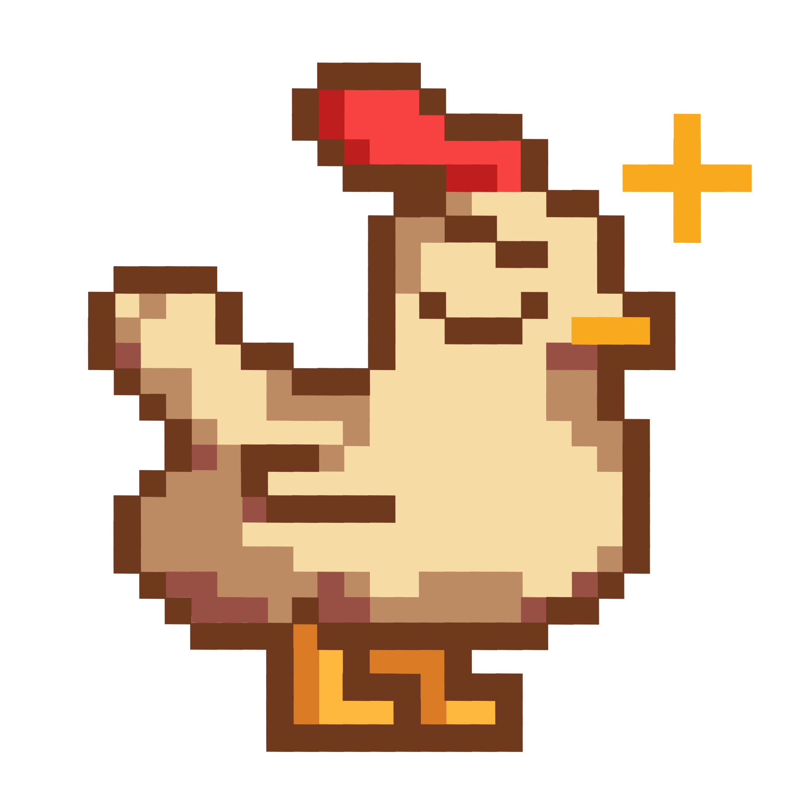

# Setup Instructions

Follow the instructions in the order below to set up the project.

1. Set up the [backend](./backend/README.md) first

2. Then set up the [model](./model/README.md)

3. Then set up the [frontend](./frontend/README.md)
